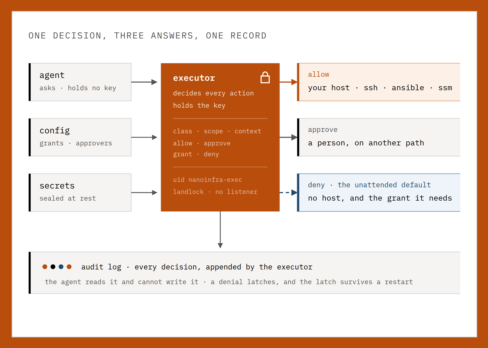

<picture>
  <source media="(prefers-color-scheme: dark)" srcset="./images/readme-cover-dark.svg">
  
</picture>

<div align="center">
  <p>
    <a href="https://github.com/nanoinfraorg/nanoinfra/releases/latest"></a>
    <a href="https://github.com/nanoinfraorg/nanoinfra"></a>
    <a href="https://pypi.org/project/nanoinfra/"></a>
    <a href="https://github.com/nanoinfraorg/nanoinfra/pkgs/container/nanoinfra"></a>
    <a href="https://github.com/nanoinfraorg/nanoinfra/actions/workflows/ci.yml"></a>
    <a href="https://pypi.org/project/nanoinfra/"></a>
    <a href="./LICENSE"></a>
  </p>
  <p>
    <a href="./COMMUNICATION.md">GitHub / Email</a>
  </p>
</div>

# nanoinfra

**nanoinfra** is an ultra-lightweight, open-source, self-hosted AI agent for infrastructure work, written in Python. It keeps an inventory of your servers, the credentials to reach them, and the tools to act on them over SSH, Ansible, AWS SSM, or an HTTP endpoint — reachable from a WebUI, a terminal, or sixteen chat apps. Tools, long-term memory, MCP integrations, model routing, multi-agent delegation, scheduled automation, and an OpenAI-compatible API sit in a core small enough to audit.

Root access, on a short leash: the agent reaches your hosts with credentials you hold, and a capability gate in a separate process decides on every remote command. An unattended turn reaches no host by default, an unusual one waits for a person on a second authenticated path, and a refusal is terminal for that session. The agent process holds neither the credentials nor the transports, and it runs unprivileged itself.

## Start Here

| You want to... | Go to |
|---|---|
| Install nanoinfra with no terminal/config background | [Start Without Technical Background](https://docs.nanoinfra.org/start-without-technical-background/) |
| Install quickly and get one CLI reply | [Install](#-install) and [Quick Start](#-quick-start) |
| Open the bundled browser UI | [WebUI](#-webui) |
| Connect Telegram, Discord, Slack, Signal, Email, Mattermost, or another chat app | [Chat Apps](https://docs.nanoinfra.org/chat-apps/) |
| Configure providers, fallback models, Langfuse, MCP, web tools, or security | [Docs](https://docs.nanoinfra.org/) and [Configuration](https://docs.nanoinfra.org/configuration/) |
| Understand or extend the internals | [Architecture](https://docs.nanoinfra.org/architecture/) and [Development](https://docs.nanoinfra.org/development/) |
| Run nanoinfra on your own server or keep it running as a service | [Deployment](https://docs.nanoinfra.org/deployment/) |

## What can nanoinfra do?

nanoinfra is a self-hosted personal AI agent runtime. It can:

- run in a browser WebUI or terminal
- connect to Telegram, Discord, Slack, Signal, Email, Mattermost, and other chat apps
- use tools such as files, shell, web search, web fetch, MCP, cron, image generation, and subagents
- keep session history and long-term memory through Dream
- run long-horizon goals and scheduled automations
- expose a Python SDK and OpenAI-compatible API for integrations
- deploy as a long-running local or server-side agent gateway

## 💡 Why nanoinfra

- **Persistent workflows**: goals, memory, tools, and chat context survive long-running work.
- **Chat-native reach**: WebUI, API, Telegram, Slack, Discord, Signal, Teams, email, and Mattermost.
- **Model freedom**: OpenAI-compatible APIs, local LLMs, image generation, search, and fallbacks.
- **Small core**: readable internals with MCP, memory, deployment, and automation built in.
- **Own your stack**: inspect, customize, self-host, and extend without a giant platform.

## 📦 Install

> [!IMPORTANT]
> If you want the newest features and experiments, install from source.
>
> If you want the most stable day-to-day experience, install from PyPI or with `uv`.

Pick **one** install method:

Prerequisites: Python 3.11 or newer, or Docker for the container. Git is only needed for a source install. Published packages already include the WebUI; a current-source install needs `bun` or `npm` to build it.

If terminals, API keys, or config files are new to you, use the guided zero-background walkthrough in [Start Without Technical Background](https://docs.nanoinfra.org/start-without-technical-background/) instead of this compact README path.

**Install with `uv`**

```bash
uv tool install nanoinfra
```

**Install from PyPI with pip**

```bash
python -m pip install nanoinfra
```

If pip reports `externally-managed-environment` on macOS or Linux, use `uv tool install nanoinfra`, `pipx install nanoinfra`, or install inside a virtual environment.

**Run the container**

The image is the deployment where the kernel enforces the privilege split: the entrypoint starts as root, places the executor on `nanoinfra-exec`, the fetcher on `nanoinfra-fetch` and the MCP host on `nanoinfra-mcp`, and drops root before any of them serves. A single-account install cannot do that, and nanoinfra says so at startup.

```bash
# first run: write the config
docker run -it --rm -v ~/.nanoinfra:/home/nanoinfra/.nanoinfra \
  ghcr.io/nanoinfraorg/nanoinfra:latest onboard --wizard

# then the gateway
docker run -d --name nanoinfra \
  -v ~/.nanoinfra:/home/nanoinfra/.nanoinfra \
  -p 127.0.0.1:8765:8765 \
  ghcr.io/nanoinfraorg/nanoinfra:latest gateway
```

Tags are `latest`, the minor (`1.0`) and the exact version (`1.0.3`), for `linux/amd64`. Pin the exact version in production, so an upgrade is something you do rather than something that happens.

`gateway` is not optional: the image's default command is `status`. No `--security-opt` and no added capability is needed either — a root start already holds the five the entrypoint uses (`SETUID`, `SETGID`, `CHOWN`, `FOWNER`, `DAC_OVERRIDE`), and Docker has allowed the Landlock syscalls since 20.10.13. To keep everything else off the process, [`docker-compose.yml`](./docker-compose.yml) drops all capabilities and adds back only those five.

One thing to know before you publish a port: the WebUI and the WebSocket channel bind `127.0.0.1` **inside** the container, and Docker's `-p` cannot reach a container's loopback. To use the published port, set `channels.websocket.host` to `"0.0.0.0"` in `~/.nanoinfra/config.json` and give the channel a `tokenIssueSecret` — it refuses to start on all interfaces without a token, a static one or a proxy identity. [Deployment](https://docs.nanoinfra.org/deployment/#docker) has the exact config block.

A first start says what it built, and this is the part worth reading:

```text
[entrypoint] executor starting as nanoinfra-exec on /run/nanoinfra-exec/executor.sock
[confinement] executor confinement: landlock abi 7, 48 filesystem rules, no tcp listener
[entrypoint] fetcher account: nanoinfra-fetch (separate uid from the agent)
[confinement] fetcher confinement: landlock abi 7, 41 filesystem rules, tcp connect limited to 53, 80, 443
[entrypoint] MCP host account: nanoinfra-mcp (separate uid from the agent)
[entrypoint] agent runs without NANOINFRA_SECRETS_KEY: the executor holds it
```

**Install from source**

`bun` or `npm` must be available, because the install builds the WebUI. With `uv`, which reads the lockfile in the repo:

```bash
git clone https://github.com/nanoinfraorg/nanoinfra.git
cd nanoinfra
uv sync
uv run nanoinfra --version
```

Or with pip, from an activated virtual environment:

```bash
git clone https://github.com/nanoinfraorg/nanoinfra.git
cd nanoinfra
python -m pip install .
```

Contributors who need an editable checkout should follow [`CONTRIBUTING.md`](./CONTRIBUTING.md) and [`webui/README.md`](./webui/README.md).

Verify the install:

```bash
nanoinfra --version
```

If `nanoinfra` is not on `PATH`, invoke it through the method that installed it: `uv tool run --from nanoinfra nanoinfra ...`, `pipx run --spec nanoinfra nanoinfra ...`, `uv run nanoinfra ...` in a source checkout, or the Python executable from the environment where pip installed the package.

## 🚀 Quick Start

**Open nanoinfra in your browser**

```bash
nanoinfra webui
```

This is the recommended first run. The launcher creates the config and workspace when needed, safely enables the local WebSocket channel after confirmation, starts the gateway, and opens [`http://127.0.0.1:8765`](http://127.0.0.1:8765). A fresh install can open before a model is configured, so setup continues in the browser instead of beginning in a JSON file. The first-run WebUI binds to localhost by default and is not exposed to your LAN.

**Your first three steps**

1. Open **Settings → Models** and choose a provider, credential, and model.
2. Start a new topic and send `Hello!` to verify the connection.
3. Before project work, choose the intended workspace and access mode from the composer.

Any normal reply means the provider, model, workspace, and browser gateway are working together.

**Keep nanoinfra running after you close the terminal**

```bash
nanoinfra webui --background
```

This starts the same full gateway as `nanoinfra webui`, opens the browser, and leaves channels and automations running after the launcher exits. Complete first-time model setup with foreground `nanoinfra webui` before switching to background mode.

```bash
nanoinfra gateway status
nanoinfra gateway logs
nanoinfra gateway restart
nanoinfra gateway stop
```

**Prefer a gateway-first workflow?**

```bash
nanoinfra gateway
```

This skips WebUI setup and browser opening, then runs the same complete gateway in the current terminal. It is the familiar entry point if you are coming from OpenClaw or already operate agents as long-lived services. The WebUI remains available when its channel is configured; open it manually when needed.

Use `nanoinfra gateway --background` for the same direct entry point without keeping the terminal attached. For automatic startup and supervision by the operating system, see [Deployment](https://docs.nanoinfra.org/deployment/).

**Prefer to work entirely in the terminal?**

```bash
nanoinfra agent
```

This opens an interactive terminal chat with the same configured model, workspace, and tools while keeping its own CLI session history. It does not open a browser or keep chat channels and automations running after you exit. Type `exit` or press `Ctrl+C` when you are done.

For one request and an immediate exit, use:

```bash
nanoinfra agent -m "Hello!"
```

The one-shot form is useful for a quick provider check, shell scripts, and local automation. If you have not configured a model yet, run `nanoinfra webui` and open **Settings → Models** first.

Need manual JSON, another device on your LAN, or help with provider/model matching? Continue with [Install and Quick Start](https://docs.nanoinfra.org/quick-start/), [WebUI](https://docs.nanoinfra.org/webui/), or [Troubleshooting](https://docs.nanoinfra.org/troubleshooting/).

If nanoinfra worked for you, a star on GitHub is the simplest way to support the project.

- Want a pasteable provider setup? See [Provider Cookbook](https://docs.nanoinfra.org/provider-cookbook/)
- Want to understand provider/model matching? See [Providers and Models](https://docs.nanoinfra.org/providers/)
- Want web search, MCP, security settings, or more config options? See [Configuration](https://docs.nanoinfra.org/configuration/)
- Want to run locally? See [Ollama](https://docs.nanoinfra.org/providers/#ollama), [vLLM or another local OpenAI-compatible server](https://docs.nanoinfra.org/providers/#vllm-or-other-local-openai-compatible-server), and the full [provider reference](https://docs.nanoinfra.org/configuration/#providers).
- Want to run nanoinfra in chat apps like Telegram, Discord, Slack or Signal? See [Chat Apps](https://docs.nanoinfra.org/chat-apps/)
- Want Docker, Docker Compose, a Linux service, or a macOS LaunchAgent? See [Deployment](https://docs.nanoinfra.org/deployment/)

## 🌐 WebUI

The WebUI ships **inside the published wheel** with no separate frontend build. It is the browser workbench for persistent topics, visible agent activity, workspace controls, Apps, Skills, Automations, and settings.

<p align="center">
  
</p>

Use it to:

- keep separate topics for different tasks and projects;
- inspect reasoning, tool calls, file edits, diffs, command output, and generated artifacts;
- switch models and workspaces without leaving the conversation;
- configure providers, chat channels, Apps, Skills, and Automations from one place.

See the [WebUI guide](https://docs.nanoinfra.org/webui/) for LAN access, background operation, workspace controls, and the full feature tour. Working on the frontend itself? Use [`webui/README.md`](./webui/README.md).

## 🏗️ Architecture

<p align="center">
  
</p>

Two things run this, and they are deliberately not the same process.

**The loop** is small. A channel publishes an inbound message on an async bus, `AgentLoop` builds the context, `AgentRunner` holds the conversation with the provider and executes the tools it asks for, and the reply goes back out on the bus. Memory and skills arrive as context rather than as an orchestration layer, which is what keeps the core path readable and the core small enough to audit.

**The boundary** is the part the loop cannot talk its way around. A remote action is not something the agent performs; it is something the agent *asks for*. A second process owns the credential store, resolves one secret for one action, answers with `allow`, `approve`, `grant` or `deny`, and appends that decision to a log the agent may read and may not write. The agent holds neither the credential nor the decision. An unattended turn gets the strictest answer, because nobody is watching it, and a denial latches for the session — rebuilt from that log after a restart, so a refusal survives the thing that was refused.

In the container these are four processes on four accounts, which `ps -eo user,comm --forest` shows by name:

| process | account | what it holds |
|---|---|---|
| `gateway` | `nanoinfra` | the agent loop, the channels, the WebUI. No credential and no verdict |
| `exec` | `nanoinfra-exec` | the credential store, the gate decision, the audit log |
| `fetch` | `nanoinfra-fetch` | web search and web fetch, and nothing of yours |
| `mcp` | `nanoinfra-mcp` | stdio MCP servers, each with its own Landlock policy |

Each helper applies a Landlock policy to itself before it serves, so its reachable filesystem is a list rather than a convention: 48 rules on the executor, 41 on the fetcher, 45 on the MCP host, none of them with a TCP listener. Outside a container, with a single account, all four still run and nanoinfra says at startup that the split is organisational rather than kernel-enforced — the same words, whether or not anyone is reading.

[Capability gates](https://docs.nanoinfra.org/capability-gates/) states every default. [Deployment](https://docs.nanoinfra.org/deployment/) states what makes the split kernel-enforced.

## 📚 Docs

Browse the [repo docs](https://docs.nanoinfra.org/) for the latest features and GitHub development version.

- Use task-oriented guides: [Guides](https://docs.nanoinfra.org/guides/)
- Start with no technical background: [Start Without Technical Background](https://docs.nanoinfra.org/start-without-technical-background/)
- Start from zero with developer basics: [Install and Quick Start](https://docs.nanoinfra.org/quick-start/)
- Understand the runtime model: [Concepts](https://docs.nanoinfra.org/concepts/)
- Read the source-level map: [Architecture](https://docs.nanoinfra.org/architecture/)
- Choose a provider/model: [Providers and Models](https://docs.nanoinfra.org/providers/)
- Copy provider setup recipes: [Provider Cookbook](https://docs.nanoinfra.org/provider-cookbook/)
- Debug setup and runtime failures: [Troubleshooting](https://docs.nanoinfra.org/troubleshooting/)
- Talk to your nanoinfra with familiar chat apps: [Chat App AI Agent](https://docs.nanoinfra.org/guides/chat-app-ai-agent/) · [Chat Apps](https://docs.nanoinfra.org/chat-apps/)
- Schedule or trigger agent work: [Automations](https://docs.nanoinfra.org/automations/)
- Store credentials and let the agent connect to a server: [Secrets and Servers](https://docs.nanoinfra.org/secrets-and-servers/)
- Configure providers, web search, MCP, and runtime behavior: [Configuration](https://docs.nanoinfra.org/configuration/)
- Integrate nanoinfra with local tools and automations: [OpenAI-Compatible API](https://docs.nanoinfra.org/openai-api/) · [Python SDK](https://docs.nanoinfra.org/python-sdk/)
- Run nanoinfra with Docker or as a Linux service: [Deployment](https://docs.nanoinfra.org/deployment/)

## Releases

The badge at the top of this page is the current release. What changed in it:

- **[CHANGELOG.md](./CHANGELOG.md)** — every version since 1.0.0, one line per change, in
  [Keep a Changelog](https://keepachangelog.com/en/1.1.0/) form. Start here.
- **[Release archive](https://docs.nanoinfra.org/release-archive/)** — the 0.x history, and the
  long-form account of each older release including the faults found along the way.
- **[GitHub releases](https://github.com/nanoinfraorg/nanoinfra/releases)** — tags and downloads.
  From 1.7.0 a release body is its changelog section, quoted.

Versions are `MAJOR.MINOR.PATCH`. A breaking change is called out in its `### Changed` or
`### Removed` entry and marked `!` in the commit that made it.

## 🤝 Contribute

Use nanoinfra for a real task, report what broke, and then pick a focused improvement.

- Read [CONTRIBUTING.md](./CONTRIBUTING.md) for the development workflow.
- Browse [open issues](https://github.com/nanoinfraorg/nanoinfra/issues) for problems to investigate.
- Open a [pull request](https://github.com/nanoinfraorg/nanoinfra/pulls) for a focused fix or integration.

## Contact

Nanoinfra is a fork of [nanobot](https://github.com/re-bin/nanobot), the original open-source project started by [Xubin Ren](https://github.com/re-bin). This fork is maintained by Alberto Ferrer. Feel free to contact [albertof@barrahome.org](mailto:albertof@barrahome.org) for questions, ideas, or collaboration.

### Contributors

<a href="https://github.com/nanoinfraorg/nanoinfra/graphs/contributors">
  
</a>

<p align="center">
  <em> Thanks for visiting ✨ nanoinfra!</em><br><br>
  
</p>
