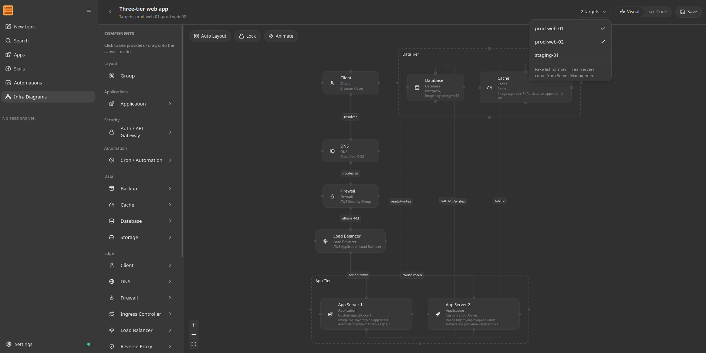

<picture>
  <source media="(prefers-color-scheme: dark)" srcset="./images/readme-cover-dark.svg">
  
</picture>

<div align="center">
  <p>
    <a href="https://github.com/nanoinfraorg/nanoinfra"></a>
    <a href="https://pypi.org/project/nanoinfra/"></a>
    <a href="https://github.com/nanoinfraorg/nanoinfra/actions/workflows/ci.yml"></a>
    <a href="https://pypi.org/project/nanoinfra/"></a>
    <a href="./LICENSE"></a>
  </p>
  <p>
    <a href="./COMMUNICATION.md">GitHub / Email</a>
  </p>
</div>

# nanoinfra

**nanoinfra** is an ultra-lightweight, open-source, self-hosted AI agent for infrastructure work, written in Python. It keeps an inventory of your servers, the credentials to reach them, and the tools to act on them over SSH, Ansible, AWS SSM, or an HTTP endpoint — reachable from a WebUI, a terminal, or sixteen chat apps. Tools, long-term memory, MCP integrations, model routing, multi-agent delegation, scheduled automation, and an OpenAI-compatible API sit in a core small enough to audit.

Root access, on a short leash: the agent reaches your hosts with credentials you hold, and a capability gate in a separate process decides on every remote command. An unattended turn reaches no host by default, an unusual one waits for a person on a second authenticated path, and a refusal is terminal for that session. The agent process holds neither the credentials nor the transports, and it runs unprivileged itself.

## Start Here

| You want to... | Go to |
|---|---|
| Install nanoinfra with no terminal/config background | [Start Without Technical Background](https://docs.nanoinfra.org/start-without-technical-background/) |
| Install quickly and get one CLI reply | [Install](#-install) and [Quick Start](#-quick-start) |
| Open the bundled browser UI | [WebUI](#-webui) |
| Connect Telegram, Discord, WeChat, Slack, Email, Mattermost, or another chat app | [Chat Apps](https://docs.nanoinfra.org/chat-apps/) |
| Configure providers, fallback models, Langfuse, MCP, web tools, or security | [Docs](https://docs.nanoinfra.org/) and [Configuration](https://docs.nanoinfra.org/configuration/) |
| Understand or extend the internals | [Architecture](https://docs.nanoinfra.org/architecture/) and [Development](https://docs.nanoinfra.org/development/) |
| Deploy to the cloud or keep nanoinfra running as a service | [Deployment](https://docs.nanoinfra.org/deployment/) |

## What can nanoinfra do?

nanoinfra is a self-hosted personal AI agent runtime. It can:

- run in a browser WebUI or terminal
- connect to Telegram, Discord, Slack, WeChat, Email, Mattermost, and other chat apps
- use tools such as files, shell, web search, web fetch, MCP, cron, image generation, and subagents
- keep session history and long-term memory through Dream
- run long-horizon goals and scheduled automations
- expose a Python SDK and OpenAI-compatible API for integrations
- deploy as a long-running local or server-side agent gateway

## 💡 Why nanoinfra

- **Persistent workflows**: goals, memory, tools, and chat context survive long-running work.
- **Chat-native reach**: WebUI, API, Telegram, Feishu, Slack, Discord, Teams, email, and Mattermost.
- **Model freedom**: OpenAI-compatible APIs, local LLMs, image generation, search, and fallbacks.
- **Small core**: readable internals with MCP, memory, deployment, and automation built in.
- **Own your stack**: inspect, customize, self-host, and extend without a giant platform.

## 📦 Install

> [!IMPORTANT]
> If you want the newest features and experiments, install from source.
>
> If you want the most stable day-to-day experience, install from PyPI or with `uv`.

Pick **one** install method:

Prerequisites: Python 3.11 or newer. Git is only needed for a source install. Published packages already include the WebUI; a current-source install needs `bun` or `npm` to build it.

If terminals, API keys, or config files are new to you, use the guided zero-background walkthrough in [Start Without Technical Background](https://docs.nanoinfra.org/start-without-technical-background/) instead of this compact README path.

**One-command setup**

macOS / Linux:

```bash
curl -fsSL https://raw.githubusercontent.com/nanoinfraorg/nanoinfra/main/scripts/install.sh | sh
```

The default command installs or upgrades `nanoinfra` from PyPI. On a fresh local desktop, it then starts `nanoinfra webui` so you can configure the first provider and model in **Settings → Models**. SSH, headless, existing-config, and older-release paths keep the terminal setup wizard. The installer avoids system-wide pip installs by using an active virtual environment, `uv`, `pipx`, or a managed venv under `~/.nanoinfra/venv`. It also prints the exact command it used to run nanoinfra; reuse that full command below if `nanoinfra` is not on `PATH`.

To preview the plan without changing your environment, pass `--dry-run`; combine it with `--dev` when you want to preview the main-branch install.

```bash
curl -fsSL https://raw.githubusercontent.com/nanoinfraorg/nanoinfra/main/scripts/install.sh | sh -s -- --dry-run
```

To install the current `main` branch instead, pass `--dev`:

```bash
curl -fsSL https://raw.githubusercontent.com/nanoinfraorg/nanoinfra/main/scripts/install.sh | sh -s -- --dev
```

If you prefer to inspect the script first, open [`scripts/install.sh`](./scripts/install.sh).

**Install with `uv`**

```bash
uv tool install nanoinfra
```

**Install from PyPI with pip**

```bash
python -m pip install nanoinfra
```

If pip reports `externally-managed-environment` on macOS or Linux, use the one-command installer, `uv tool install nanoinfra`, `pipx install nanoinfra`, or install inside a virtual environment.

**Install from source**

`bun` or `npm` must be available. From an activated virtual environment:

```bash
git clone https://github.com/nanoinfraorg/nanoinfra.git
cd nanoinfra
python -m pip install .
```

Contributors who need an editable checkout should follow [`CONTRIBUTING.md`](./CONTRIBUTING.md) and [`webui/README.md`](./webui/README.md).

Verify the install:

```bash
nanoinfra --version
```

If `nanoinfra` is not on `PATH`, invoke it through the method that installed it: reuse the recommended installer's command, use `uv tool run --from nanoinfra nanoinfra ...` or `pipx run --spec nanoinfra nanoinfra ...`, or use the Python executable from the environment where pip installed the package.

## 🚀 Quick Start

**Open nanoinfra in your browser**

```bash
nanoinfra webui
```

This is the recommended first run. The launcher creates the config and workspace when needed, safely enables the local WebSocket channel after confirmation, starts the gateway, and opens [`http://127.0.0.1:8765`](http://127.0.0.1:8765). A fresh install can open before a model is configured, so setup continues in the browser instead of beginning in a JSON file. The first-run WebUI binds to localhost by default and is not exposed to your LAN.

**Your first three steps**

1. Open **Settings → Models** and choose a provider, credential, and model.
2. Start a new topic and send `Hello!` to verify the connection.
3. Before project work, choose the intended workspace and access mode from the composer.

Any normal reply means the provider, model, workspace, and browser gateway are working together.

**Keep nanoinfra running after you close the terminal**

```bash
nanoinfra webui --background
```

This starts the same full gateway as `nanoinfra webui`, opens the browser, and leaves channels and automations running after the launcher exits. Complete first-time model setup with foreground `nanoinfra webui` before switching to background mode.

```bash
nanoinfra gateway status
nanoinfra gateway logs
nanoinfra gateway restart
nanoinfra gateway stop
```

**Prefer a gateway-first workflow?**

```bash
nanoinfra gateway
```

This skips WebUI setup and browser opening, then runs the same complete gateway in the current terminal. It is the familiar entry point if you are coming from OpenClaw or already operate agents as long-lived services. The WebUI remains available when its channel is configured; open it manually when needed.

Use `nanoinfra gateway --background` for the same direct entry point without keeping the terminal attached. For automatic startup and supervision by the operating system, see [Deployment](https://docs.nanoinfra.org/deployment/).

**Prefer to work entirely in the terminal?**

```bash
nanoinfra agent
```

This opens an interactive terminal chat with the same configured model, workspace, and tools while keeping its own CLI session history. It does not open a browser or keep chat channels and automations running after you exit. Type `exit` or press `Ctrl+C` when you are done.

For one request and an immediate exit, use:

```bash
nanoinfra agent -m "Hello!"
```

The one-shot form is useful for a quick provider check, shell scripts, and local automation. If you have not configured a model yet, run `nanoinfra webui` and open **Settings → Models** first.

Need manual JSON, another device on your LAN, or help with provider/model matching? Continue with [Install and Quick Start](https://docs.nanoinfra.org/quick-start/), [WebUI](https://docs.nanoinfra.org/webui/), or [Troubleshooting](https://docs.nanoinfra.org/troubleshooting/).

If nanoinfra worked for you, a star on GitHub is the simplest way to support the project.

- Want a pasteable provider setup? See [Provider Cookbook](https://docs.nanoinfra.org/provider-cookbook/)
- Want to understand provider/model matching? See [Providers and Models](https://docs.nanoinfra.org/providers/)
- Want web search, MCP, security settings, or more config options? See [Configuration](https://docs.nanoinfra.org/configuration/)
- Want to run locally? See [Ollama](https://docs.nanoinfra.org/providers/#ollama), [vLLM or another local OpenAI-compatible server](https://docs.nanoinfra.org/providers/#vllm-or-other-local-openai-compatible-server), and the full [provider reference](https://docs.nanoinfra.org/configuration/#providers).
- Want to run nanoinfra in chat apps like Telegram, Discord, WeChat or Feishu? See [Chat Apps](https://docs.nanoinfra.org/chat-apps/)
- Want Docker or Linux service deployment? See [Deployment](https://docs.nanoinfra.org/deployment/)

<a id="deploy-to-render"></a>

## ☁️ Deploy

**Render — one click**

Deploy nanoinfra's gateway and bundled WebUI from the repository's ready-to-use Blueprint:

[](https://render.com/deploy?repo=https://github.com/nanoinfraorg/nanoinfra)

Render will ask for `ANTHROPIC_API_KEY` and a private `NANOINFRA_WEB_TOKEN`, then provision persistent storage for sessions, memory, and WebUI history. Persistent disks require a paid Render service.

**Self-host**

Prefer your own infrastructure? Follow the [deployment guide](https://docs.nanoinfra.org/deployment/) for Docker, Docker Compose, Linux services, and macOS LaunchAgent setup.

## 🌐 WebUI

The WebUI ships **inside the published wheel** with no separate frontend build. It is the browser workbench for persistent topics, visible agent activity, workspace controls, Apps, Skills, Automations, and settings.

<p align="center">
  
</p>

Use it to:

- keep separate topics for different tasks and projects;
- inspect reasoning, tool calls, file edits, diffs, command output, and generated artifacts;
- switch models and workspaces without leaving the conversation;
- configure providers, chat channels, Apps, Skills, and Automations from one place.

See the [WebUI guide](https://docs.nanoinfra.org/webui/) for LAN access, background operation, workspace controls, and the full feature tour. Working on the frontend itself? Use [`webui/README.md`](./webui/README.md).

## 🏗️ Architecture

<p align="center">
  
</p>

🐈 nanoinfra stays lightweight by centering everything around a small agent loop: messages come in from chat apps, the LLM decides when tools are needed, and memory or skills are pulled in only as context instead of becoming a heavy orchestration layer. That keeps the core path readable and easy to extend, while still letting you add channels, tools, memory, and deployment options without turning the system into a monolith.

## 📚 Docs

Browse the [repo docs](https://docs.nanoinfra.org/) for the latest features and GitHub development version.

- Use task-oriented guides: [Guides](https://docs.nanoinfra.org/guides/)
- Start with no technical background: [Start Without Technical Background](https://docs.nanoinfra.org/start-without-technical-background/)
- Start from zero with developer basics: [Install and Quick Start](https://docs.nanoinfra.org/quick-start/)
- Understand the runtime model: [Concepts](https://docs.nanoinfra.org/concepts/)
- Read the source-level map: [Architecture](https://docs.nanoinfra.org/architecture/)
- Choose a provider/model: [Providers and Models](https://docs.nanoinfra.org/providers/)
- Copy provider setup recipes: [Provider Cookbook](https://docs.nanoinfra.org/provider-cookbook/)
- Debug setup and runtime failures: [Troubleshooting](https://docs.nanoinfra.org/troubleshooting/)
- Talk to your nanoinfra with familiar chat apps: [Chat App AI Agent](https://docs.nanoinfra.org/guides/chat-app-ai-agent/) · [Chat Apps](https://docs.nanoinfra.org/chat-apps/)
- Schedule or trigger agent work: [Automations](https://docs.nanoinfra.org/automations/)
- Store credentials and let the agent connect to a server: [Secrets and Servers](https://docs.nanoinfra.org/secrets-and-servers/)
- Configure providers, web search, MCP, and runtime behavior: [Configuration](https://docs.nanoinfra.org/configuration/)
- Integrate nanoinfra with local tools and automations: [OpenAI-Compatible API](https://docs.nanoinfra.org/openai-api/) · [Python SDK](https://docs.nanoinfra.org/python-sdk/)
- Run nanoinfra with Docker or as a Linux service: [Deployment](https://docs.nanoinfra.org/deployment/)

## Releases

**Latest release: [v0.9.0 - The Short Leash Release](https://github.com/nanoinfraorg/nanoinfra/releases/tag/v0.9.0)**

The Short Leash Release makes the security posture on the landing page true in the code. Every mutating and remote-execution tool now passes a gate, and the agent process no longer holds the credentials or the transports it used to.

- **Capability gates.** Each tool carries a capability class (`read`, `mutate.local`, `mutate.inventory`, `mutate.remote`, `credential.access`), and each action resolves a scope of `host`, `group`, or `all`. Policy lives in a `gates` block in `config.json`, and an unattended context denies remote execution by default. `all` scope is denied with no runtime path at all
- **The agent asks, and another process decides.** Remote execution, web fetch and search, and stdio MCP servers each run in their own process behind a Unix socket, under their own account, and under a Landlock policy. The agent process holds no credential store and no transport, so a prompt injection that reaches a tool reaches neither
- **A human approves an unusual action, on a different path.** An `approve` decision suspends the action and waits. The approval must arrive from an authenticated path other than the one the request came from, it covers the exact resolved command and host list the executor rendered, and it expires. Recurring work uses standing grants in config instead, so a human is prompted for the unusual case and keeps reading the prompt
- **A denial is terminal.** A refused action latches its capability class for that session, so the agent cannot retry with a slightly different command until something gets through. Only an operator clears the latch, and the latch survives a restart because it rebuilds from the audit log
- **Every decision is on the record.** An append-only audit log holds one record per decision, including denials, expiries, and latched refusals. It holds a command digest by default, because a resolved command routinely embeds a secret
- **Three new surfaces in the WebUI:** the gate policy panel in Settings, the latch banner in a session, and the audit log viewer. Plus an approvals inbox with its own route and an unread count
- Credential values no longer reach a transcript, a reasoning pane, or an SDK snapshot. `export_unredacted_with_secrets` is the one documented exception

[Read the v0.9.0 release notes](https://github.com/nanoinfraorg/nanoinfra/releases/tag/v0.9.0)

## Recent Updates

- **2026-08-15** v0.9.1 fixes what v0.9.0 shipped broken: the latch clear and the approvals inbox could not answer over the WebSocket transport, an allowed action refused its own credential, the Secrets form could not take an SSH private key, and a diagnosed traceback could write a plaintext credential into a log file.
- **2026-08-15** Capability gates on every mutating tool, remote execution and web access in their own confined processes, human approval on a second path, terminal denials, and an append-only audit log.
- **2026-08-13** Moved to the nanoinfraorg organisation, docs at docs.nanoinfra.org, a self-hosted skills catalog, and Windows support dropped.
- **2026-08-07** Durable subagent transcripts, drag-to-attach sessions, trusted-proxy auth, and session-retention/Dream data-loss fixes.
- **2026-08-07** Secrets and Servers: encrypted credential storage, a server inventory, and agent-driven remote execution (SSH/Ansible Runner/SSM/API) with durable job tracking.
- **2026-08-04** Infra Diagrams: visual designer with real persistence, a dynamic component catalog, and agent tools with an approval gate.
- **2026-07-24** Guided first-run setup, inline subagents, and model switching from the composer.
- **2026-07-23** Grok OAuth with hosted X Search, live image settings, and clearer fallback models.

For older updates, see the [release archive](https://docs.nanoinfra.org/release-archive/) or [GitHub releases](https://github.com/nanoinfraorg/nanoinfra/releases).

## 🤝 Contribute

Use nanoinfra for a real task, report what broke, and then pick a focused improvement.

- Read [CONTRIBUTING.md](./CONTRIBUTING.md) for the development workflow.
- Browse [open issues](https://github.com/nanoinfraorg/nanoinfra/issues) for problems to investigate.
- Open a [pull request](https://github.com/nanoinfraorg/nanoinfra/pulls) for a focused fix or integration.

## Contact

Nanoinfra is a fork of [nanobot](https://github.com/re-bin/nanobot), the original open-source project started by [Xubin Ren](https://github.com/re-bin). This fork is maintained by Alberto Ferrer. Feel free to contact [albertof@barrahome.org](mailto:albertof@barrahome.org) for questions, ideas, or collaboration.

### Contributors

<a href="https://github.com/nanoinfraorg/nanoinfra/graphs/contributors">
  
</a>

<p align="center">
  <em> Thanks for visiting ✨ nanoinfra!</em><br><br>
  
</p>
